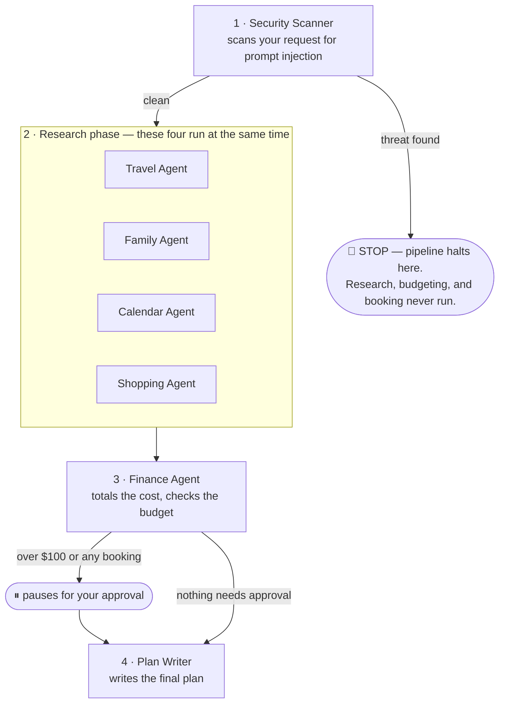
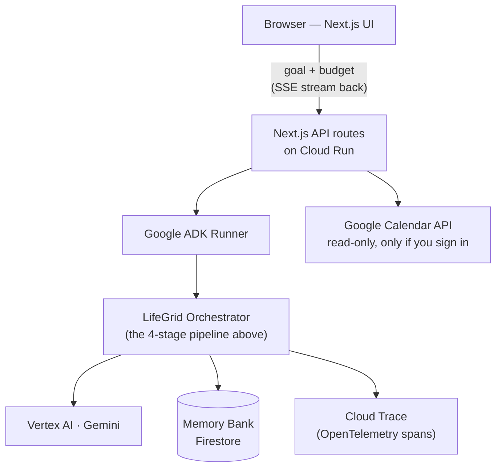

<div align="center">


### LifeGrid

**A team of small AI agents that plan real-life tasks together — safely.**

Give it one goal in plain English (*"Plan a 5-day family trip to Denver under $4,000"*) and a team of specialist agents research it, check your budget, and stop to ask before anything gets booked or spent.

Built with **Google ADK**, **Gemini**, and **Google Cloud** for the *All Things Agentic Hackathon — Fortified Enterprise Fleet* track.

[Quick start](#quick-start) · [How it works](#how-it-works) · [Meet the agents](#meet-the-agents) · [Tech stack](#tech-stack) · [Deploy](#deploy-to-google-cloud-run)

</div>

---

## What is LifeGrid?

Most AI assistants are one model trying to do everything. LifeGrid does it differently: it splits a household request into **seven small, specialized agents**, each with one job and a strict set of permissions, coordinated by a fixed pipeline instead of letting the AI freely decide what to do next.

That matters for two reasons:

- **It's safer.** A security check runs first, on a fixed track the AI can't talk its way around. If it finds something malicious, the whole run stops right there — nothing downstream runs.
- **It asks before it spends.** Anything over $100, or any flight/hotel booking, pauses for your explicit yes/no before it happens.

LifeGrid ships with two modes: a **free scripted demo** (no API calls, no cost) and a **Live mode** that runs the real agents against Gemini on Vertex AI.

## How it works

A request always moves through the same four stages — the order is fixed in code, not something the AI decides, so a cleverly worded prompt can't talk it into skipping the safety check.



Stage 1 is **sequential**, stage 2 is **parallel** (four agents at once instead of one after another), and stages 3–4 are sequential again. That mix is exactly why LifeGrid is built as a Google ADK `SequentialAgent` wrapping a `ParallelAgent`, rather than one big agent or a fully model-directed flow.

**A real security stop, not just a warning.** Earlier versions only *reported* a blocked threat while every other agent kept running anyway. LifeGrid now sets a flag in session state the moment Model Armor blocks something, and every downstream agent checks it before doing any work — so a blocked threat genuinely halts the run.

### Request → response, end to end



You type a goal and a budget in the browser. The server starts the agents and streams back what each one is doing as it happens, instead of making you wait for one final answer. Along the way, agents look up things you've told LifeGrid before (like "no early flights") from a small memory store, and anything that needs your OK pauses and waits for you.

## Meet the agents

| # | Agent | Job | Tools it uses |
|---|---|---|---|
| 1 | **Security Scanner** | Runs first, always. Scans your request for prompt-injection attempts before anything else acts on it. | Model Armor scan (real) |
| 2 | **Travel Agent** | Finds flights and hotels, filtered against things you've told it before (e.g. "not too far from downtown"). | Flight/hotel search (simulated), Memory Bank read (real) |
| 2 | **Family Agent** | Finds kid-friendly activities and dining, respecting dietary and accessibility needs. | Activity search (simulated), Memory Bank read/write (real) |
| 2 | **Calendar Agent** | Checks your schedule for conflicts in the trip dates. | Google Calendar, read-only (real when connected, else simulated) |
| 2 | **Shopping Agent** | Works out what you'd need to pack or buy for the trip. | Gear/packing search (simulated) |
| 3 | **Finance Agent** | Adds everything up, checks it against your budget cap, and asks for your approval on anything over $100 or any booking. | Budget check + human-approval gate (real) |
| 4 | **Plan Writer** | Compiles every other agent's results into one final, readable plan. | none — just writes the summary |

*Row "2" is one stage — those four agents run concurrently, not one after another.*

Every agent can only use the tools it's explicitly been given (**Zero-Trust**) — a call to anything outside that list is blocked automatically, not just discouraged. You can see this live in the app's **Agents** tab.

## Governance, in plain terms

Three independent checks, each doing one job:

| Pillar | What it actually does |
|---|---|
| **Model Armor** | Scans your request text for prompt-injection patterns (e.g. "ignore all previous instructions") — including attempts hidden inside URLs, so joining words with `+` or percent-encoding doesn't slip past it. A detected threat sets a flag that stops every later agent from running. |
| **Policy Engine** | One rule, enforced the same way everywhere: any spend over $100, or any flight/hotel booking, must be approved by a human before it happens. |
| **Zero-Trust** | Every agent has a declared, narrow list of tools it's allowed to call. Anything outside that list is denied by default, not just unlisted. |

## Try it

Two ways to run a request:

- **Scripted Demo** — replays a realistic canned example. Free, no API calls, good for a first look.
- **Live mode** — runs the real agent pipeline against Gemini on Vertex AI. Costs a small amount of real API spend.

In **Settings**, pick which Gemini model Live mode uses:

| Option | Model | When to use it |
|---|---|---|
| **Lite** (default) | `gemini-3.5-flash-lite` | Fastest and cheapest — good for most requests. |
| **Standard** | `gemini-3.5-flash` | A step up in reasoning quality, costs a little more per run. |
| **Auto** | *(LifeGrid's own default per agent)* | Let LifeGrid decide — currently resolves to Lite for every agent. |

## Tech stack

| Layer | What's used |
|---|---|
| Agent framework | [Google ADK](https://github.com/google/adk-js) (`@google/adk`) — `SequentialAgent` + `ParallelAgent` |
| AI models | Gemini 3.5 Flash-Lite and Gemini 3.5 Flash, via Vertex AI |
| Frontend | Next.js 16 (App Router, Turbopack), React 19, Tailwind CSS v4 |
| Auth | Auth.js (NextAuth) — Google sign-in for read-only Calendar access |
| Hosting | Google Cloud Run |
| Persistent memory | Google Cloud Firestore (falls back to in-memory when not on Cloud Run) |
| Observability | Google Cloud Trace, via OpenTelemetry |
| Calendar | Google Calendar API (read-only) |

## Project structure

An npm workspaces monorepo — the agent logic ships as its own package, independent of this UI:

```
life-grid/
├── packages/agent/     @lifegrid/agent — the entire multi-agent pipeline
│   └── src/
│       ├── agents/     one folder per agent (instructions.md + agent.ts)
│       ├── gateway/     Model Armor, Policy Engine, Zero-Trust
│       ├── memory/      Firestore-backed Memory Bank
│       ├── tools.ts     every tool every agent can call
│       └── runner.ts    the ADK Runner that drives it all
├── apps/web/           @lifegrid/web — the Next.js frontend
└── docs/                design docs and hackathon submission materials
```

`packages/agent` has zero dependency on Next.js — it's usable standalone from any Node app, a CLI, or a different UI entirely.

## Quick start

```bash
git clone https://github.com/vvishnoi/life-grid.git
cd life-grid
npm install
npm run dev
```

Open [http://localhost:3000](http://localhost:3000). Scripted Demo mode works immediately with no setup.

### Turning on Live mode

Copy `apps/web/.env.local.example` to `apps/web/.env.local` and fill in:

```bash
GOOGLE_GENAI_USE_VERTEXAI=true
GOOGLE_CLOUD_PROJECT=your-gcp-project-id
GOOGLE_CLOUD_LOCATION=global
```

Then authenticate once locally: `gcloud auth application-default login`. Everything else in that file (Google sign-in, a shared demo key for public deploys, forcing Firestore locally) is optional — see the comments in the file itself.

## Deploy to Google Cloud Run

```bash
gcloud auth login
gcloud config set project <your-project-id>
DEMO_API_KEY=<a-secret-you-pick> ./scripts/gcp-up.sh
```

One idempotent script sets up everything: APIs, Artifact Registry, a least-privilege runtime service account, and the Cloud Run deploy itself. Tear it down with `./scripts/gcp-down.sh` (asks for confirmation first).

See [`docs/COST_OPTIMIZATION.md`](docs/COST_OPTIMIZATION.md) before deploying somewhere public — it covers scale-to-zero, instance caps, and gating the paid endpoints behind a shared key.

## What's real vs. simulated, honestly

| Piece | Status |
|---|---|
| Security scanning, budget/approval gate, Zero-Trust permissions | **Real** — actually enforced, not decorative |
| Memory Bank | **Real** — Firestore when deployed to Cloud Run, in-memory for local dev |
| Google Calendar | **Real** — read-only, only when you sign in |
| Flights, hotels, activities, gear | **Simulated** — realistic sample data; swapping in a real API is an isolated change, not an architecture change |
| Long-running task recovery | **Partial** — a run is tied to one open connection; it doesn't yet resume on its own if that connection drops |

Full detail, including known limitations verified by actually running the system live: [`docs/IMPLEMENTATION_PLAN.md`](docs/IMPLEMENTATION_PLAN.md).

## License

[MIT](LICENSE) — use it, fork it, build on it.
