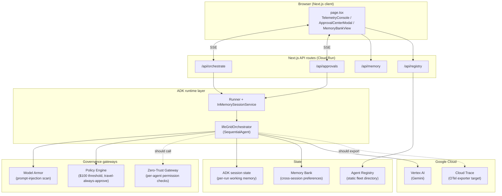
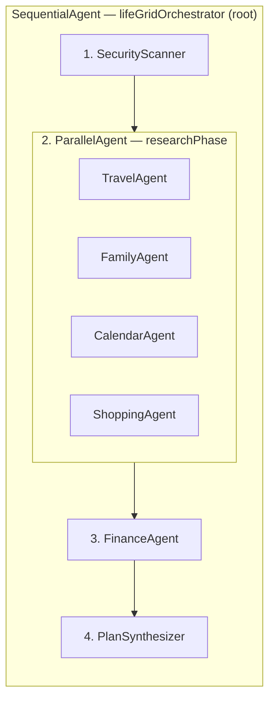
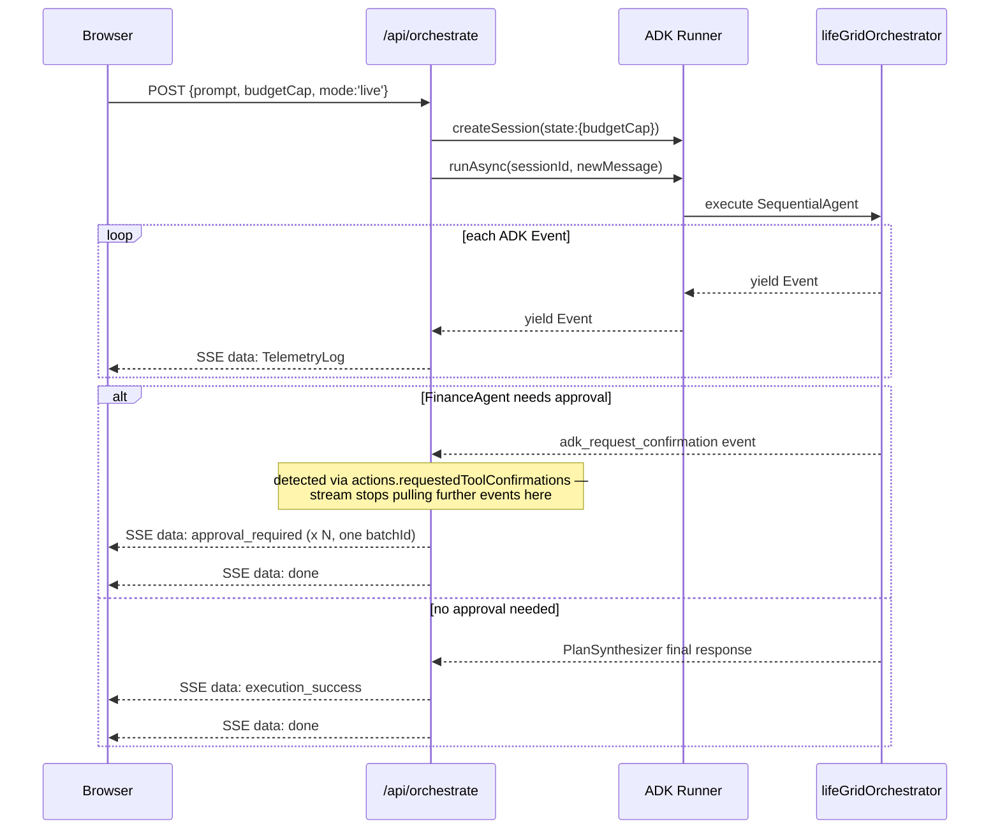
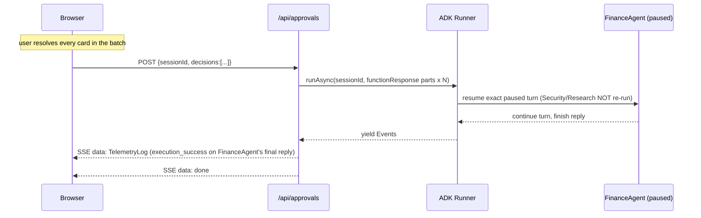

# LifeGrid — Requirements, Design & Implementation

**Audience:** any engineer or agent picking up this codebase cold. This is
the source of truth, structured deliberately in three parts — **what was
asked for, what was designed to satisfy it, and what actually got built**
— so design intent and build status are never confused with each other.
If a design decision and the current code disagree, the code is behind,
not the doc; that gap is itself tracked in Part 3.

**Target:** [All Things Agentic Hackathon](https://allthingsagentichackathon.devpost.com/)
— **Fortified Enterprise Fleet** track (the project's own name comes
directly from this track). Deadline: August 31, 2026, 5:00pm PDT.

---
---

# PART 1 — REQUIREMENTS

## 1.1 Problem statement

The Fortified Enterprise Fleet track asks for "a scalable network of
institutional agents that hook into official enterprise infrastructure."
Concretely, that means: multiple specialized agents, coordinated by a
runtime, discoverable through a registry, governed by identity and policy
controls, inspected for security threats inline, and observable end to
end — not a single chatbot with tools bolted on. LifeGrid instantiates
this as a household/family-office assistant fleet (travel, family,
calendar, shopping, finance agents) specifically *because* that domain
naturally produces the things the track wants to see: multi-step
autonomous research, real spend decisions that need human sign-off, and
personalization that must persist across sessions.

## 1.2 Functional requirements (derived from the track description)

| ID | Requirement |
|---|---|
| FR-1 | A user submits one natural-language goal + a budget cap; the system autonomously decomposes it into sub-tasks across specialized agents. |
| FR-2 | Every agent that could run is discoverable ahead of time, with a declared role, capabilities, and permission set (Agent Registry). |
| FR-3 | Independent research tasks run concurrently, not serially, to bound latency. |
| FR-4 | User input and any externally-sourced content is inspected for prompt injection / malicious payloads *before* an agent acts on it. |
| FR-5 | Any action above a spend threshold, or any travel booking regardless of amount, must pause for explicit human approval before proceeding. |
| FR-6 | Approved/rejected decisions must resume the *actual paused agent run*, not just be logged for show. |
| FR-7 | Agents read and write a persistent memory of user preferences that influences behavior across the session (and, ideally, across sessions). |
| FR-8 | Every step an agent takes is visible to the user in near-real-time (telemetry), not only as a final summary. |
| FR-9 | The system must degrade gracefully to a zero-cost, zero-credential demo mode when live infrastructure isn't configured. |

## 1.3 Non-functional requirements

| ID | Requirement | Driven by |
|---|---|---|
| NFR-1 | **Zero-trust access control** — each agent's access to each resource domain is explicitly scoped, not ambient. | Track's "Agent Identity" pillar |
| NFR-2 | **Unified policy enforcement** for spend/booking decisions, not scattered per-agent logic. | Track's "Agent Gateway" pillar |
| NFR-3 | **Inline security guardrails** against prompt injection, tool poisoning, and PII leaks. | Track's "Model Armor" pillar |
| NFR-4 | **OpenTelemetry-compliant** audit logs and end-to-end reasoning traces. | Track's "Agent Observability" pillar |
| NFR-5 | **Persistent, secure cross-session memory.** | Track's "Memory Bank" pillar |
| NFR-6 | **Long-running, asynchronous execution** — an agent run should not be bound to a single client HTTP connection's lifetime. | Track's "Agent Runtime" pillar |
| NFR-7 | **Bounded, predictable cost per run** — Flash-tier models by default, scale-to-zero infra, hard instance caps. | Judging weight on architectural discipline + practical hackathon budget constraints |
| NFR-8 | **Deterministic, auditable control flow** — the set of agents that can run, and the order security/approval gates fire in, must not be something an LLM can talk its way around. | Enterprise governance is the track's whole premise |

## 1.4 Universal must-have technologies (every track, per official rules)

| Requirement | Choice made |
|---|---|
| Gemini 3.5 or newer, via Gemini API or Vertex AI | Vertex AI (project-scoped, matches "enterprise" framing better than a personal API key) |
| At least one Google Agent Framework | Google ADK (`@google/adk`) |
| At least one Google Cloud infra service | Cloud Run |

## 1.5 Submission deliverables (official checklist)

Category selection · hosted project URL · text description (features/tech/data sources/learnings) · public or private repo (private → share with `testing@devpost.com` and `cloudhackathons@google.com`) · README.md spin-up instructions · architecture diagram · ~4-minute live demo video on Google Cloud (not localhost).

## 1.6 Judging criteria (weighted)

- **Innovation & Operational Utility — 40%**: how much real-world friction does the agent remove *on its own*.
- **Architectural Discipline & Tech Stack — 30%**: decoupling, state/memory management, credential security, failure handling.
- **Demo & Production Readiness — 30%**: live unedited demo, clean architecture diagram, reproducible setup, visible proof it runs on GCP.

---
---

# PART 2 — SYSTEM DESIGN

This part describes how the system is *designed* to satisfy Part 1 —
architecture, data flow, contracts, and the reasoning behind each major
decision — independent of how completely that design has been built out
today. Build status lives entirely in Part 3.

## 2.1 Design goals and constraints that shaped every decision below

1. Security and approval gates must be **structurally** unskippable, not just instructed — a fixed control-flow graph, not a free-form agent that decides its own next step.
2. Cost and latency must be bounded and predictable per run.
3. The frontend must show live progress, not a spinner-then-dump.
4. The design must degrade to something that runs with zero GCP credentials, because judges and future contributors will `git clone` before they configure anything.

## 2.2 High-level architecture



Dotted lines mark connections the *design* calls for that aren't wired up
yet — see Part 3 for exactly which.

## 2.3 Multi-agent orchestration design



**Decision: `SequentialAgent` at the root, not a dynamic/routed
multi-agent pattern.**
- *Alternative considered*: a router `LlmAgent` that decides at runtime
  which specialist to hand off to (ADK supports agent-to-agent transfer).
- *Rejected because*: the security gate must be **structurally**
  unskippable (NFR-8). A model deciding its own control flow can in
  principle be reasoned or prompt-injected into skipping it; a fixed
  `subAgents` array cannot skip a step — it's not a decision the model
  gets to make.
- *Also*: real data dependencies are linear at the phase level —
  `FinanceAgent` needs `travel_results`/`family_results`/`shopping_results`
  populated; `PlanSynthesizer` needs `finance_results`. A `SequentialAgent`
  models exactly that.
- *Also*: bounded cost (NFR-7) and zero-trust permissions scoped to a
  known roster (NFR-1) both require a **closed, fixed set** of agents
  that can run — a dynamic transfer graph doesn't guarantee that.

**Decision: `ParallelAgent` for the research phase.**
- `TravelAgent`, `FamilyAgent`, `CalendarAgent`, `ShoppingAgent` are
  mutually independent — none reads another's `outputKey`, each writes
  to a distinct one. No correctness cost to running them concurrently,
  and a direct latency win (four Flash calls in the time of one instead
  of four).

**Decision: no `LoopAgent`.**
- No phase needs iterative refinement in v1 (e.g. "keep re-searching
  until under budget"). Every phase runs exactly once. Flagged as a
  plausible future addition (loop `ResearchPhase` + `FinanceAgent` if
  over budget), not an oversight.

## 2.4 Component design — the six Fortified Enterprise Fleet pillars

Each of these is specified at the *design* level here; Part 3 states how
much of each is actually built.

**Agent Registry (Discovery & Lifecycle).** A single static, versioned
directory (`AgentInfo[]`) is the source of truth for which agents exist,
what they're allowed to touch, and their risk profile. Every other
component (Zero-Trust, the UI's agent cards, telemetry attribution) reads
from this one place — no agent identity should be invented ad hoc
elsewhere.

**Agent Runtime + Memory Bank (Core Execution & State).** Design intent:
an agent invocation should be able to outlive a single client HTTP
connection — a user should be able to close their browser mid-run and
come back to see progress, and approvals should be resumable hours later.
Memory Bank is designed as two distinct stores that must not be conflated:
*session state* (per-run working memory — `travel_results`,
`finance_results`, etc., scoped to one goal) versus the *Memory Bank
proper* (cross-session preferences — "dislikes remote hotels," "daughter
has nut allergy" — that must survive and inform runs weeks apart). The
latter is the one the track means by "persistent, secure cross-session
context over extended timelines."

**Agent Identity (Security & Governance).** Every tool call an agent
makes should be checked against that agent's declared permissions in the
Registry *before* it executes — not just described in the Registry for
show. Design: a `beforeToolCallback` (a real ADK extension point) that
calls a zero-trust check per tool invocation, denying anything the
calling agent's registry entry doesn't explicitly grant.

**Agent Gateway (Security & Governance).** All policy-relevant decisions
(spend thresholds, booking consent) should route through one evaluator
with one set of rules, called from one place, so the rule can't drift
between agents. Design: a single `PolicyEngine.evaluateAction()` call
site is the only path by which any agent can trigger a human-approval
requirement.

**Model Armor (Security & Governance).** Three distinct guardrail
categories are named by the track: *prompt injection* (malicious
instructions embedded in user or external content), *tool poisoning*
(a tool's returned data itself containing adversarial content that could
manipulate the next agent turn), and *PII leaks* (sensitive data
surfacing somewhere it shouldn't, e.g. in a log or a downstream API
call). Design calls for inspection at two points: inbound (user goal
text, before any agent sees it) and at tool-result boundaries (before a
tool's output re-enters agent context).

**Agent Observability (Telemetry).** Two audiences, two outputs from the
same underlying event stream: a human-facing live console (the
`TelemetryLog` SSE stream already described in §2.6/2.7), and a
machine-facing OpenTelemetry trace per agent invocation, exported to
Cloud Trace, so a reasoning chain can be reconstructed and audited after
the fact without relying on the demo UI.

## 2.5 Data model

| Type | Purpose | Key fields |
|---|---|---|
| `AgentInfo` | Registry entry | `id, name, role, category, capabilities, permissions[], riskProfile` |
| `TelemetryLog` | One observable event in the UI stream | `id, agentId, agentName, type, message, riskLevel?, threatDetected?, approvalItem?, metadata?` |
| `ApprovalItem` | A pending or resolved human-approval request | `id, agentId, title, summary, actionType, amount, riskScore, riskLevel, status, batchId?` |
| `MemoryItem` | One cross-session preference/fact | `id, category, key, value, sentiment, sourceAgent, updatedAt` |

`TelemetryLog.type` is a closed union: `orchestration \| thought \|
tool_call \| security_inspection \| approval_required \| memory_update \|
execution_success \| security_alert \| error`. `ApprovalItem.batchId`
groups approvals requested in the same model turn — see §2.7, they must
be resolved together (a Gemini function-calling protocol constraint, not
a design preference).

ADK session state (distinct from `MemoryItem`, per §2.4) is a flat
key-value map per run: `budgetCap` (seeded at session creation),
`security_scan_result`, `travel_results`, `family_results`,
`calendar_results`, `shopping_results`, `finance_results`, `final_plan`
— one key per agent's `outputKey`.

## 2.6 API contracts

**`POST /api/orchestrate`**
Request: `{ customPrompt: string, budgetCap: number, scenarioId?: string, mode: 'scripted' | 'live' }`
- `scripted` → single JSON response, `{ success, steps: Step[] }` (canned, zero-cost).
- `live` → `text/event-stream` response. Each frame is `data: {json}\n\n` where json is one of:
  `{kind:'session', sessionId}` · `{kind:'log', log: TelemetryLog}` · `{kind:'done'}` · `{kind:'error', message}`.

**`POST /api/approvals`**
Request (live): `{ sessionId: string, decisions: [{functionCallId: string, action: 'approve'|'reject'}] }` — must include every decision from the same batch in one call.
Request (scripted): `{ approvalId, action }` → plain JSON ack.
Response (live): same SSE frame format as `/api/orchestrate`.

**`GET /api/memory`** → `{ success, memories: MemoryItem[] }`. **`POST /api/memory`** → adds one `MemoryItem`.

**`GET /api/registry`** → `{ success, totalAgents, agents: AgentInfo[] }`.

Both live endpoints accept an optional `x-demo-key` header, checked
against `DEMO_API_KEY` server-side when that env var is set (cost
control — see Part 3).

## 2.7 Sequence diagrams

**Fresh live run:**



**Approval resume:**



## 2.8 Key design decisions (decision log)

| Decision | Alternative considered | Why this way |
|---|---|---|
| SSE streaming, not buffer-then-replay | Run the whole pipeline server-side, return one JSON blob | A multi-agent run can take 20–40+ real seconds; one long-held request risks platform timeouts and defeats the point of showing live telemetry. SSE is native to Next.js Route Handlers, no new dependency. |
| Batch approvals by model-turn, not per-card | Resume immediately on each individual approve/reject click | Gemini's function-calling protocol requires every function call from one turn to get a response before the next turn — a partial resume is a hard API error, not a UX nicety. |
| `InMemorySessionService`, not a persistent session store | `DatabaseSessionService` / Firestore-backed sessions | Sufficient for a single warm process (local dev, one steady Cloud Run instance); explicitly does not survive multi-instance scaling or instance recycling — see NFR-6 gap in Part 3. |
| Scripted mode as the default, live mode opt-in | Default straight to live | A fresh `git clone && npm install && npm run dev` must work with zero GCP credentials configured (design goal #4). |
| Vertex AI over a plain Gemini API key | `GEMINI_API_KEY` | Matches the "enterprise, project-scoped" framing of the track; auth via Application Default Credentials rather than a bearer secret in `.env`. |

---
---

# PART 3 — IMPLEMENTATION

Where the design in Part 2 stands today. Status is honest, not
aspirational.

## 3.1 Design-to-build status, per pillar (Part 2 §2.4)

| Pillar | Design (§2.4) | Built? | Detail |
|---|---|---|---|
| Agent Registry | Single static directory, source of truth for identity/permissions | ✅ Done | `src/lib/agents/registry.ts`, `ENTERPRISE_AGENT_REGISTRY`, 7 agents, served via `GET /api/registry` |
| Agent Runtime | Execution outlives a single HTTP connection | ⚠️ Partial | Real ADK `Runner`/`SequentialAgent`/`ParallelAgent` execution (`src/lib/adk/runner.ts`) — genuinely working, verified live. But bound to one SSE HTTP request's lifetime; not backed by Cloud Tasks/Pub-Sub as designed. |
| Memory Bank | Two distinct stores, cross-session one persistent | ❌ Gap | Session state works as designed (ADK, in-memory). But `src/lib/memory/firestore.ts` — the *cross-session* store — is a plain in-process JS array despite its name; resets on every restart. `@google-cloud/firestore` is installed and unused. |
| Agent Identity | `beforeToolCallback` zero-trust check on every tool call | ❌ Gap (dead code) | `ZeroTrustGateway.validateAccess()` (`src/lib/gateway/zero-trust.ts`) is real, correct logic — but is never called from the live pipeline. Confirmed by grep: imported in `tools.ts`, unused (lint-flagged); its only caller (`orchestrator.ts`'s `checkZeroTrust`) is itself never called. |
| Agent Gateway | One evaluator, one call site for all policy decisions | ✅ Mostly done | `PolicyEngine.evaluateAction()` (`src/lib/gateway/policy-engine.ts`) is that single call site, wired into `requestApproval` in `tools.ts`, verified live. "Unified routing" beyond policy (i.e. all agent↔tool traffic passing through one gateway layer) isn't a distinct component — it's inline in the tool. |
| Model Armor | Prompt injection + tool poisoning + PII leaks, at two boundaries | ⚠️ Partial | `ModelArmorGateway.inspectInput()` covers prompt injection only, via regex, at the inbound boundary — real and verified live against an actual injection payload. Tool poisoning and PII-leak detection: not implemented. |
| Agent Observability | Human console + OTel traces to Cloud Trace | ⚠️ Partial, high-leverage gap | The `TelemetryLog` SSE console is real and verified live. OTel: `@google/adk`'s own `base_agent.js` already wraps every agent invocation in a span (`tracer.startSpan('invoke_agent ...')`) — confirmed by reading the compiled source. ADK also ships `getGcpExporters()`/`setupOTel()` (`telemetry/google_cloud.ts`, `telemetry/setup.ts`) specifically for wiring those spans to Cloud Trace. **None of this is invoked anywhere in this app** — spans are created and discarded. This is the cheapest fix in this whole document: call ADK's own setup function once at startup. |

## 3.2 Universal must-haves — compliance

| Requirement | Status |
|---|---|
| Gemini 3.5+ via Vertex AI | ❌ **Not compliant** — `src/lib/adk/agents.ts` hardcodes `gemini-2.5-flash`, an older model than required. One-line fix once a `gemini-3.5-flash`-family model id is confirmed available in your Vertex AI project/region — but must be fixed before submitting, it's a hard eligibility bar. |
| Google Agent Framework | ✅ `@google/adk@1.6.0` |
| Google Cloud infra | ✅ Cloud Run (`cloudbuild.yaml`), not yet actually deployed — see §3.6 |

## 3.3 Real vs. simulated (be precise about this in the demo video)

**Genuinely real, verified with live Vertex AI calls:** security scanning
against a real injection payload; memory-bank reads/writes influencing
agent behavior; `PolicyEngine` correctly flagging >$100 spends and
travel bookings; the full parallel research phase running concurrently
(confirmed via near-identical timestamps in traced calls); the complete
approval pause → batched resume → completion cycle; graceful failure
with a clean SSE error frame when credentials are missing.

**Intentionally simulated:** `search_flights`, `search_hotels`,
`search_activities`, `check_calendar_availability`,
`search_gear_and_supplies` in `tools.ts` return realistic generated data,
not real external API calls — each response includes a `note` field
saying so. Swapping any one for a real API is a bounded, isolated change
(one `FunctionTool` per data source) but wasn't in scope for what's been
verified.

## 3.4 Verified by actually running the system (not just review)

1. **Security**: live injection-test preset correctly detected and handled by `securityScannerAgent`.
2. **Found & fixed — `SequentialAgent` doesn't stop on a nested pause.** First live approval-triggering run hung past a 90s timeout because `PlanSynthesizer` kept getting invoked after `FinanceAgent` paused. Root-caused in `sequential_agent.js` (no `endInvocation` check between sub-agents); fixed on the consumer side in `stream-response.ts` by breaking the event loop when `event.actions.requestedToolConfirmations` is populated.
3. **Found & fixed — premature break.** First fix attempt broke on `event.longRunningToolIds` instead, which is also set on the *initial* tool-call-request event before the tool even runs — silently swallowed all pending approvals. Corrected to check `actions.requestedToolConfirmations` specifically.
4. **Found & fixed — batch approval protocol error.** Resolving one of several simultaneous `request_human_approval` calls in isolation produced a hard Gemini API error ("number of function response parts..."). Fixed via `ApprovalItem.batchId` + client-side batching in `page.tsx`.
5. **Full happy path confirmed**: fresh live run → real flight/hotel search → multiple simultaneous approvals → full-batch resume → `execution_success` completion, inspected at the raw SSE frame level.
6. **Known, accepted limitation**: after a resumed approval, ADK 1.6.0's resumability re-enters `FinanceAgent` directly but does not hand control back to the outer `SequentialAgent` to run `PlanSynthesizer` — verified live (resume produces only `FinanceAgent` events, then stream ends). Mitigated by treating `FinanceAgent`'s own final reply as the success signal on resumed runs (`event-mapper.ts`, `isResume` flag), but the polished final itinerary from `PlanSynthesizer` is never shown after an approval. Not fixed further to avoid burning additional paid Vertex AI test cycles chasing an unverified fix mid-session.

## 3.5 Cost

Full detail in **`docs/COST_OPTIMIZATION.md`**. Summary: Flash-only
models, scale-to-zero + capped Cloud Run instances, an optional
`DEMO_API_KEY` gate on the paid live endpoints, and manual steps (billing
alerts, teardown after the demo) documented but not automated —
deliberately, since billing/deletion actions shouldn't run unattended.
Every live-mode test in §3.4 was a real, deliberately sparing paid call.

## 3.6 File map

```
src/lib/adk/
  agents.ts          — 7 LlmAgents + Sequential/ParallelAgent composition (Part 2 §2.3)
  tools.ts           — FunctionTool/LongRunningFunctionTool defs, wired to gateways
  runner.ts          — Runner + InMemorySessionService singleton
  event-mapper.ts     — raw ADK Event -> TelemetryLog/ApprovalItem (Part 2 §2.5)
  stream-response.ts — SSE builder; the pause-detection fix lives here
src/lib/gateway/
  model-armor.ts     — prompt-injection regex scanner (real, partial — §3.1)
  policy-engine.ts   — $100 threshold + travel-always-approve (real)
  zero-trust.ts      — permission-check logic (real but unwired — §3.1)
src/lib/memory/firestore.ts    — in-process array, NOT actually Firestore (§3.1)
src/lib/agents/registry.ts     — ENTERPRISE_AGENT_REGISTRY (Agent Registry pillar)
src/lib/agents/orchestrator.ts — OLD scripted/fake-delay demo path, kept as the
                                  zero-cost default fallback (mode: 'scripted')
src/app/api/orchestrate/route.ts — mode branch: scripted (old JSON) vs live (SSE)
src/app/api/approvals/route.ts   — mode branch: scripted stub vs live batch-resume
src/app/page.tsx                 — frontend orchestration, batch-approval tracking
src/lib/adk-client.ts            — SSE frame parser used by the frontend
```

## 3.7 Priority fix list before submitting

Ordered by what blocks eligibility/judging, not by difficulty:

1. **Bump the model to Gemini 3.5+** (`src/lib/adk/agents.ts`) — hard eligibility requirement, currently non-compliant.
2. **Wire ADK's own OTel exporter to Cloud Trace** (`setupOTel()`/`getGcpExporters()`, call once at startup) — closes the Observability gap almost for free, since the spans already exist.
3. **Deploy to Cloud Run for real** and record the demo video against the live URL, not localhost — biggest submission-readiness gap right now.
4. **Wire `ZeroTrustGateway.validateAccess()` into tool execution** (e.g. as a `beforeToolCallback` in `tools.ts`) — closes the Agent Identity gap; the logic already exists.
5. **Decide Memory Bank persistence**: real `@google-cloud/firestore` client, or be explicit in the submission text that it's in-memory today. Silence here is worse than either honest choice.
6. Write the README spin-up section; adapt Part 2 §2.2's diagram for the submission's architecture-diagram deliverable.
7. Only after 1–6: the `PlanSynthesizer`-after-resume gap (§3.4 point 6) and real external API integrations (§3.3) as stretch goals.
